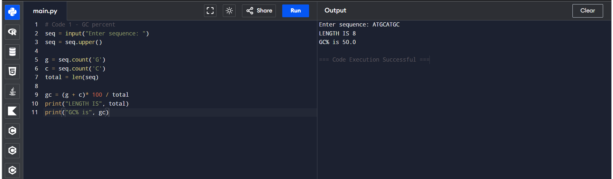
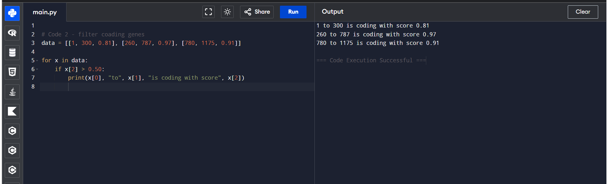
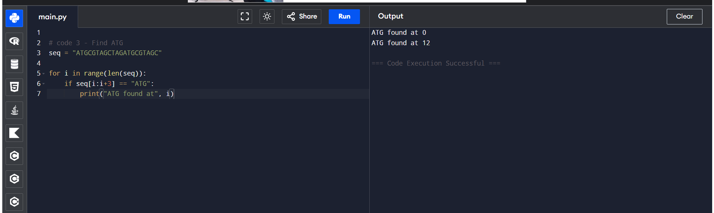
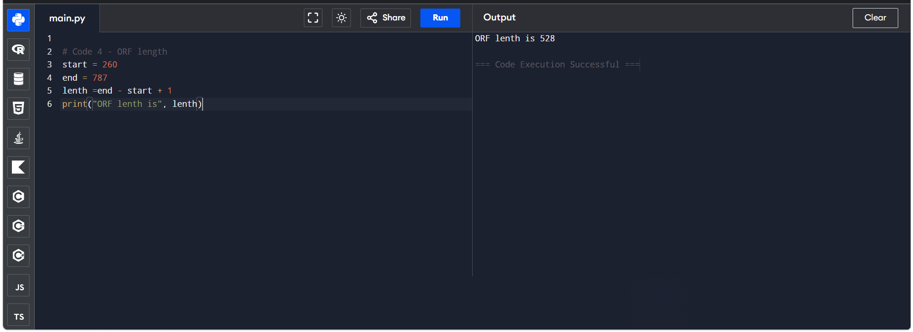

# python-for-computational-biology
Self-learning Python for biology & bioinformatics | Basics of DNA analysis, GC content, ORF prediction

### 01 - GC Content Calculation
*Code File:* 01_GC_Content.md
*Result:*

### 02 - Filter Coding Regions (Score > 0.5)
*Code File:* 02_Filter_Coding_Regions.py
*Result:*

### 03 - Find ATG (Start Codon Position)
*Code File:* 03_Find_ATG.py
*Result:*

### 04 - ORF Length Calculation
*Code File:* 04_ORF_Length.py
*Result:*

